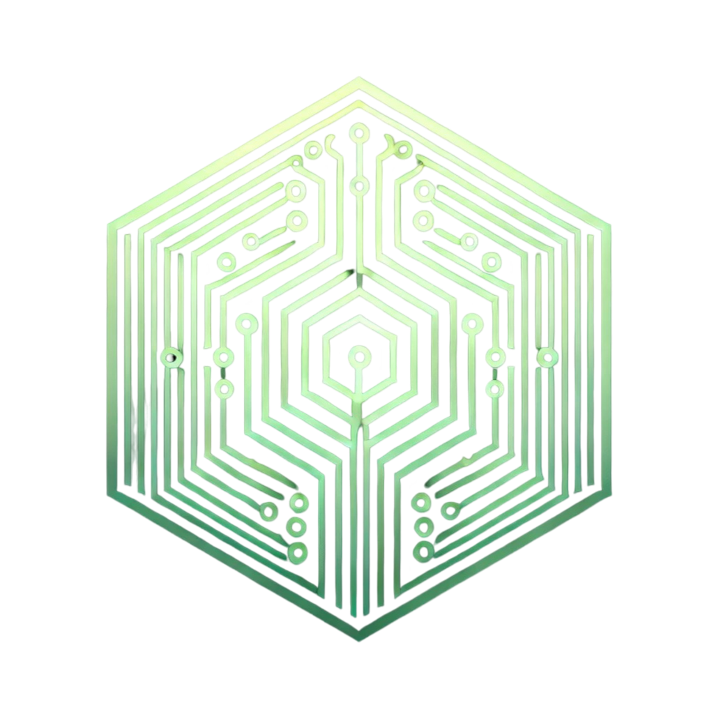

<p align="center">
  <a href="https://github.com/xutyxd/photron">
    <picture>
      <source srcset="photron-logo.png" width="150">
      
    </picture>
  </a>
</p>

<h1 align="center">
  Server to manage resources splitting into chunks for parallel download
</h1>
<h4 align="center">
 ⚠️​ This is a work in progress, the API is not stable yet.⚠️​
</h4>

## Setup

### Environment variables

```env
# Port to run the server
PORT=8080

# Keys to sign cookies
COOKIES_KEYS=[]

# Keys of OAuth2 from Google
OAUTH2_KEYS={"web":{"client_id":"client_id","project_id":"project_id","auth_uri":"https://accounts.google.com/o/oauth2/auth","token_uri":"https://oauth2.googleapis.com/token","auth_provider_x509_cert_url":"https://www.googleapis.com/oauth2/v1/certs","client_secret":"client_secret","redirect_uris":["http://localhost:8080/auth/google/callback"]}}

# MongoDB
MONGODB_URI=mongodb://localhost:27017
MONGODB_DATABASE=photron
```


## Start

```sh
npm start:local
```

## Tests

```sh
npm run test:ts
npm run test:units
npm run test:functionals
```